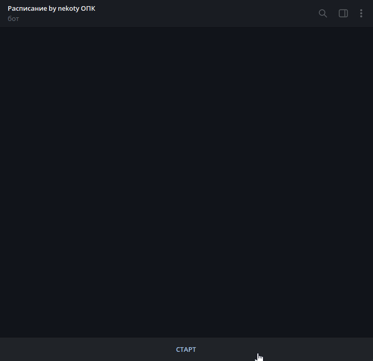
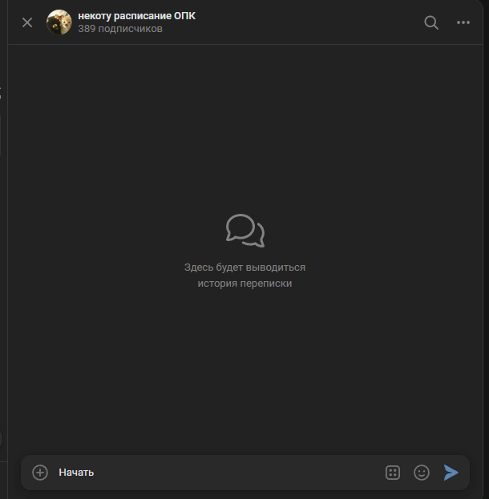

# MISIS Schedule Bot

[](LICENSE)
[](pyproject.toml)
[](https://github.com/nekotyy/misis-rasp-bot/actions/workflows/ci-cd.yml)
[](https://github.com/nekotyy/misis-rasp-bot/commits/main)
[](https://github.com/nekotyy/misis-rasp-bot/stargazers)
[](https://github.com/nekotyy/misis-rasp-bot/issues)

[](https://www.python.org/)
[](https://fastapi.tiangolo.com/)
[](https://github.com/aiogram/aiogram)
[](https://vk.com/dev)
[](https://www.docker.com/)

> Асинхронный бот расписания для колледжа МИСИС с поддержкой Telegram, VK, RabbitMQ и веб-дашборда для администрирования, мониторинга и настройки счетчиков пар.

**Быстрые ссылки:**

- [Быстрый старт](#быстрый-старт-docker)
- [Переменные окружения](#переменные-окружения)
- [Деплой и прод](#деплой-и-прод)
- [Roadmap](#roadmap)
- [Contributing](CONTRIBUTING.md)
- [Security](SECURITY.md)

## Содержание

- [Возможности](#возможности)
- [Требования](#требования)
- [Превью](#превью)
- [Быстрый старт (Docker)](#быстрый-старт-docker)
- [Локальный запуск (dev)](#локальный-запуск-dev)
- [Деплой и прод](#деплой-и-прод)
- [Прод-быстрый старт](#прод-быстрый-старт)
- [CI/CD](#cicd)
- [Переменные окружения](#переменные-окружения)
- [Архитектура](#архитектура)
- [Стек](#стек)
- [Структура проекта](#структура-проекта)
- [Хранилища данных](#хранилища-данных)
- [Как работает парсинг расписания](#как-работает-парсинг-расписания)
- [Как работает RabbitMQ](#как-работает-rabbitmq)
- [Планировщик и фоновые задачи](#планировщик-и-фоновые-задачи)
- [Счетчики пар](#счетчики-пар)
- [Веб-дашборд](#веб-дашборд)
- [Роуты веб-дашборда](#роуты-веб-дашборда)
- [Админка внутри ботов](#админка-внутри-ботов)
- [Надежность и отказоустойчивость](#надежность-и-отказоустойчивость)
- [Автобекапы админу](#автобекапы-админу)
- [Полезные команды](#полезные-команды)
- [Рекомендации для прод-эксплуатации](#рекомендации-для-прод-эксплуатации)
- [Roadmap](#roadmap)
- [Contributing](#contributing)
- [Безопасность](#безопасность)
- [Лицензия](#лицензия)

## Превью

**Telegram**



**VK**



## Возможности

- показывает расписание по группам, преподавателям и аудиториям;
- хранит пользователей, подписки, снимки расписания и события в SQLite;
- отслеживает изменения расписания и рассылает уведомления;
- работает с RabbitMQ, но не зависит от него жестко для базовой логики;
- считает пройденные пары по группам и дисциплинам;
- поднимает веб-дашборд для метрик, управления ботом и веб-пользователями;
- поддерживает массовые и тестовые рассылки;
- переживает падение одного канала связи без остановки остальных.

## Требования

- Python 3.12+ (для локального запуска)
- Docker / Docker Compose (для продового или простого запуска)
- `uv` (рекомендуется для dev) или `pip`

## Архитектура

Проект состоит из четырех основных частей:

1. `src/` — основная логика бота, парсер, планировщик, доставка, БД.
2. `web_configurator/` — FastAPI-дашборд и веб-авторизация.
3. `runtime/` — рабочие данные в Docker: SQLite, JSON счетчиков, вложения.
4. `deploy/nginx/` — шаблон nginx для публичного доступа к дашборду.

Сквозной поток данных:

1. Пользователь пишет в Telegram или VK.
2. Бот создает или обновляет запись в `users`.
3. Парсер получает расписание с сайта колледжа.
4. Снимки пишутся в `schedule_snapshots`.
5. При изменении формируется событие в `change_events`.
6. Уведомление отправляется либо через RabbitMQ, либо напрямую.
7. Ночная задача счетчиков пар учитывает прошедшие пары и пишет события в `lesson_counter_events`.

## Стек

- Python 3.12+
- `aiogram`
- `vkbottle`
- `FastAPI`
- `uvicorn`
- `aiosqlite`
- `aio-pika`
- `APScheduler`
- `httpx`
- `beautifulsoup4`
- `python-dotenv`
- `alembic`
- Docker / Docker Compose
- `nginx` для публичного reverse proxy по желанию

## Структура проекта

```text
src/
  config.py              настройки из .env
  main.py                вход в приложение
  db.py                  SQLite-схема и SQL-операции
  db_migrations.py       запуск миграций alembic
  models.py              dataclass-модели
  parser.py              парсинг расписания
  group_catalog.py       каталог групп и поиск schedule_id
  schedule_search.py     поиск групп / преподавателей / аудиторий
  schedule_service.py    форматирование и сравнение снимков
  scheduler.py           фоновые задачи APScheduler
  notifier.py            рассылки и уведомления
  message_broker.py      RabbitMQ producer / consumer
  lesson_counters.py     логика подсчета пар
  telegram_bot.py        Telegram-бот
  vk_bot.py              VK-бот

web_configurator/
  app.py                 FastAPI-приложение
  metrics.py             сбор метрик для дашборда
  lesson_editor.py       валидация и сохранение счетчиков пар
  security.py            веб-авторизация и права доступа

deploy/nginx/
  default.conf.template  шаблон nginx-конфига
```

## Хранилища данных

### SQLite

Основная база проекта — SQLite. По умолчанию локально используется `bot.db`, в Docker — `runtime/bot.db`.

Ключевые таблицы:

- `users` — TG/VK-пользователи, подписки, роли, служебные флаги;
- `schedule_snapshots` — снимки расписания;
- `change_events` — журнал изменений;
- `delivery_events` — история доставки сообщений;
- `lesson_counters` — настроенные счетчики пар;
- `lesson_counter_events` — уже учтенные пары;
- `web_users` — пользователи веб-дашборда.

### JSON

JSON в проекте используется там, где он удобен как редактируемый конфиг:

- `storage/lesson_counters.json` или `runtime/lesson_counters.json` — конфигурация счетчиков пар;
- `WEB_USERS_JSON_IMPORT_PATH` — optional путь к файлу для одноразового импорта веб-пользователей в SQLite, если нужно перенести существующие аккаунты.

## Быстрый старт (Docker)

1. Скопировать пример окружения:

```bash
cp .env.example .env
```

2. Заполнить `.env` (токены, секреты, пароли).

3. Запустить сервисы:

```bash
docker compose up -d --build
```

По умолчанию поднимутся `bot`, `rabbitmq` и `web`, а дашборд будет доступен напрямую:

```text
http://server-ip:8080
```

## Локальный запуск (dev)

1. Скопировать пример окружения:

```bash
cp .env.example .env
```

2. Заполнить `.env`.

3. Установить зависимости:

```bash
uv sync --frozen
```

4. Запустить бота:

```bash
uv run --frozen -m src.main
```

5. Запустить веб-дашборд:

```bash
uv run --frozen uvicorn web_configurator.app:app --host 0.0.0.0 --port 8080
```

## Деплой и прод

Обычный запуск:

```bash
docker compose up -d --build
```

Если нужен только рабочий бот с очередью и вебкой без reverse proxy, этого достаточно.

### Optional nginx

`nginx` в проекте необязателен и включается через профиль.

Вариант через `.env`:

```env
COMPOSE_PROFILES=nginx
```

После этого обычная команда:

```bash
docker compose up -d --build
```

поднимет:

- `bot`
- `rabbitmq`
- `web`
- `nginx`

Можно включить профиль и без `.env`:

```bash
docker compose --profile nginx up -d --build
```

Пример публичной схемы:

- `http://dashboard.example.com`
- `https://dashboard.example.com`

Внутри Docker трафик идет так:

```text
internet -> nginx -> web:8080
```

### Сертификаты

Если используется `nginx`, контейнер ожидает сертификаты в смонтированной директории:

```text
deploy/certs/live/dashboard.example.com/fullchain.pem
deploy/certs/live/dashboard.example.com/privkey.pem
```

После обновления сертификатов:

```bash
docker compose restart nginx
```

Если `nginx` отключен, этот раздел можно игнорировать: бот, RabbitMQ и дашборд работают без него.

### Что важно при деплое

1. Не потерять рабочую базу `runtime/bot.db`.
2. Держать `runtime/` на постоянном диске.
3. Проверить доступность внешнего `80/tcp`, если планируется certbot.
4. Не оставлять тестовые пароли и секреты из `.env.example`.
5. После выдачи сертификатов перезапустить `nginx`.

## Прод-быстрый старт

1. Подготовить `.env` с секретами и ID администратора.
2. Убедиться, что `runtime/` лежит на постоянном диске.
3. Запустить:

```bash
docker compose up -d --build
```

4. Проверить статус:

```bash
docker compose ps
docker compose logs -f bot
```

Если нужен публичный дашборд через `nginx`, включить профиль `nginx` и проверить сертификаты.

## CI/CD

В GitHub Actions уже настроены два базовых workflow:

- `CI/CD` — `compileall`, `pip check`, unit tests и smoke-проверка через `docker compose config`;
- `Docker Publish` — сборка и публикация образа в `ghcr.io/<owner>/<repo>` на `push` в `main` и `development`.

Публикуемые теги:

- `main` и `development` — branch tags;
- `sha-<commit>` — тег конкретного коммита;
- `latest` — только для ветки `main`.

Образ можно тянуть, например, так:

```bash
docker pull ghcr.io/nekotyy/misis-rasp-bot:development
```

Если в репозитории используется self-hosted runner, схема деплоя может быть такой:

1. На `push` в рабочую ветку запускается CI.
2. Runner делает `git pull --ff-only`.
3. Затем выполняется:

```bash
docker compose up -d --build --remove-orphans
```

Для такого сценария обычно достаточно:

- установить runner на сервер;
- подготовить `.env`;
- убедиться, что `docker compose up -d --build` вручную уже работает;
- настроить доступ сервера к GitHub для `git pull`.

## Переменные окружения

Подробные комментарии уже есть в `.env.example`, а здесь — краткая карта.

### Базовые

- `APP_TIMEZONE` — таймзона проекта.
- `SCHEDULE_URL` — базовый URL расписания.
- `DATABASE_PATH` — путь к SQLite.
- `ATTACHMENTS_PATH` — корень вложений.
- `TELEGRAM_BOT_TOKEN` — токен Telegram-бота.
- `VK_BOT_TOKEN` — токен VK-бота.
- `ADMIN_TELEGRAM_ID` — Telegram ID администратора (служебные уведомления и автобэкапы).
- `ADMIN_VK_ID` — VK ID администратора.

### RabbitMQ

- `RABBITMQ_URL` — адрес подключения.
- `RABBITMQ_QUEUE` — очередь уведомлений.
- `LESSON_COUNTERS_QUEUE` — очередь задач подсчета пар.
- `RABBITMQ_PREFETCH_COUNT` — prefetch для consumer.

### Счетчики пар

- `LESSON_COUNTERS_ENABLED` — глобальный флаг включения подсчета.
- `LESSON_COUNTERS_PATH` — путь к JSON-конфигу счетчиков.

### Веб-дашборд

- `WEB_CONFIG_SECRET` — секрет подписи cookie-сессий.
- `WEB_SUPERUSER_LOGIN` — логин встроенного суперпользователя.
- `WEB_SUPERUSER_PASSWORD` — пароль встроенного суперпользователя.
- `WEB_COOKIE_SECURE` — принудительный `Secure` для cookie вне локального запуска.
- `WEB_SESSION_TTL_SECONDS` — срок жизни web-сессии в секундах.
- `WEB_USERS_JSON_IMPORT_PATH` — optional путь для одноразового импорта веб-пользователей.
- `WEB_BIND_IP` — IP/host, на который публикуется прямой порт web-сервиса.
- `WEB_PORT` — внешний порт FastAPI-дашборда без nginx.

### Nginx

- `COMPOSE_PROFILES` — если поставить `nginx`, compose поднимет nginx-профиль.
- `NGINX_SERVER_NAME` — домен дашборда.
- `NGINX_HTTP_PORT` — внешний HTTP-порт.
- `NGINX_HTTPS_PORT` — внешний HTTPS-порт.
- `WEB_UPSTREAM` — внутренний upstream для проксирования.
- `NGINX_SSL_CERT_PATH` — путь к сертификату внутри контейнера nginx.
- `AUTO_DAILY_LESSON_COUNTER_QUEUE` — имя очереди RabbitMQ для автоматического ежедневного подсчета пар (по умолчанию `misis_auto_daily_lesson_counter`).
- `DB_CLEANUP_QUEUE` — имя очереди RabbitMQ для плановой очистки базы данных (по умолчанию `misis_db_cleanup`).
- `NGINX_SSL_KEY_PATH` — путь к приватному ключу внутри контейнера nginx.

## Как работает парсинг расписания

Основная логика находится в `src/parser.py`, `src/group_catalog.py`, `src/schedule_search.py` и `src/schedule_service.py`.

### Базовый URL

`SCHEDULE_URL` задает базовую точку входа к сайту расписания. Безопасные варианты:

- `http://asu.sf-misis.ru/rasp/`
- `http://asu.sf-misis.ru/rasp/600`

Парсер сам формирует адрес группы как `{base}/{schedule_id}`.

### Загрузка HTML

`ScheduleParser`:

1. собирает URL нужной группы;
2. выполняет HTTP GET через `httpx`;
3. использует retry/backoff;
4. возвращает HTML для последующего разбора.

### Разбор страницы

`BeautifulSoup` проходит по HTML и собирает нормализованный снимок:

- даты;
- пары внутри каждой даты;
- предмет;
- преподаватель;
- аудитория;
- время;
- сопутствующие поля, которые нужны для форматирования.

### Хеш снимка

После парсинга формируется нормализованный JSON и считается SHA256-хеш. Это позволяет быстро понять, изменилось расписание или нет, без ручного сравнения строк.

### Каталоги групп и поиск

`GroupCatalog` и `ScheduleSearchCatalog` отвечают за:

- загрузку каталога групп;
- поиск `schedule_id`;
- поиск по преподавателям;
- поиск по аудиториям;
- частичное совпадение по запросу;
- нормализацию пользовательского ввода.

### Сравнение снимков

`ScheduleComparator` сравнивает baseline и current:

- по дням;
- по составу пар;
- по содержимому самих записей.

Если находится различие, создается `ChangeSummary`, который потом идет в БД и в уведомления.

## Как работает RabbitMQ

Основная логика очередей находится в `src/message_broker.py` и `src/notifier.py`.

### Очереди

В проекте используются две основные очереди:

- `RABBITMQ_QUEUE` — пользовательские уведомления;
- `LESSON_COUNTERS_QUEUE` — задачи подсчета пар.

### Producer

Когда бот или веб-дашборд формирует событие на доставку:

1. собирается полезная нагрузка;
2. сообщение публикуется в очередь;
3. consumer забирает его уже отдельно от основного потока.

### Consumer

Consumer:

1. получает сообщение;
2. определяет платформу и адресата;
3. отправляет сообщение через Telegram или VK;
4. пишет результат доставки в `delivery_events`;
5. подтверждает сообщение.

### Ack, retry и fallback

Если доставка успешна — сообщение подтверждается. Если нет — применяется логика повторной обработки или прямой доставки, смотря в каком участке конвейера произошла проблема.

Что важно practically:

- RabbitMQ полезен для всплесков уведомлений;
- бот не должен становиться хрупким из-за очереди;
- при недоступности RabbitMQ основная логика проекта не теряет жизнеспособность.

## Планировщик и фоновые задачи

Фоновые задачи собраны в `src/scheduler.py` и запускаются через `APScheduler`.

Основные сценарии:

- сохранение дневного baseline;
- резервное сохранение baseline;
- синхронизация current snapshot;
- сравнение baseline/current;
- запись событий изменений;
- запуск задач подсчета пар (автоматический сбор в 23:20, с контрольными проверками в 23:50, 01:00 и 05:00);
- еженедельная очистка старых данных старше 90 дней (по понедельникам в 04:30 или ручной вызов `/cleandb`).

Время и поведение зависят от настроек проекта и таймзоны `APP_TIMEZONE`.

## Счетчики пар

Логика собрана в `src/lesson_counters.py`, а конфиг хранится в JSON.

### Что хранится в конфиге

Для каждой группы задаются:

- `schedule_id`
- `group_name`
- список дисциплин
- преподаватель
- `passed`
- `total` (или `null` / `##?` для неразмеченных дисциплин)

### Автоматический подсчет пар

1. Каждый день в 23:20 (и в контрольные точки 23:50, 01:00, 05:00) публикуется задача `AutoDailyLessonCounterJob` в RabbitMQ (`AUTO_DAILY_LESSON_COUNTER_QUEUE`).
2. Для каждой активной группы парсится расписание за день.
3. Проведенные пары считаются по формуле: 1 пара = +1, 2 пары = +2, 3 пары = +3 к полю `passed`.
4. Для 100% защиты от повторных или недозаписанных начислений проверяется журнал SQLite `daily_lesson_counter_logs(target_date_iso, group_name)`. Повторный запуск за ту же дату пропускает уже учтенную группу.
5. Если дисциплина новая — она автоматически создается с `total: null` (`##?`), а в сообщении пользователю выводится сноска с контактами администратора ([t.me/nekoty](https://t.me/nekoty) или [vk.ru/nekotyy](https://vk.ru/nekotyy)).

### Валидация

В `web_configurator/lesson_editor.py` конфиг проверяется по реальному расписанию:

- существует ли группа;
- существует ли дисциплина;
- нормализуется ли название;
- совпадает ли преподаватель;
- не повреждена ли структура JSON.

Поэтому можно редактировать счетчики и через формы, и через raw JSON, не теряя базовую защиту от опечаток.

Дополнительно:

- сравнение дисциплин идет через нормализацию и мягкое совпадение ($subject\_matches$), поэтому допускаются «Информатика» vs «Информатика (лекция)»;
- несовпадение преподавателя помечается как предупреждение, но не блокирует сохранение;
- ошибки уровня error блокируют сохранение, предупреждения лишь показываются.
- при необходимости можно сохранить конфиг несмотря на ошибки (кнопка «Сохранить несмотря на ошибки»).

### Быстрое добавление списком

В веб-редакторе доступен режим массового ввода. Формат строк:

```text
Дисциплина | Преподаватель | прошли | всего
```

`прошли/всего` можно не указывать — тогда будет 0. Строки с `#` игнорируются.

## Веб-дашборд

Веб-модуль живет в `web_configurator/` и запускается на FastAPI + Uvicorn.

OpenAPI и `/docs` отключены, чтобы не публиковать внутренние схемы наружу в продовой конфигурации.

Основные разделы:

1. `Метрики`
2. `Счетчики пар`
3. `Управление ботом`
4. `Веб-пользователи`

### Что показывает дашборд

- аптайм;
- общее число пользователей;
- разбивку TG/VK;
- новых и старых пользователей;
- подписки на преподавателей и группы;
- тихих пользователей;
- статус Telegram / VK / RabbitMQ;
- последний парс расписания;
- последнее изменение расписания;
- журнал последних изменений;
- активные группы и число пользователей в них;
- доставку сообщений за сегодня и за все время;
- состояние счетчиков пар.

### Что умеет раздел управления

- массовая рассылка;
- тестовая рассылка;
- ручной перепарс активных источников;
- ручное сохранение baseline;
- управление веб-пользователями и их правами.

### Права веб-пользователей

Права выдаются точечно:

- `stats_overview` — верхние карточки и общая сводка;
- `stats_users` — список пользователей и фильтры;
- `stats_services` — статусы Telegram, VK и RabbitMQ;
- `stats_schedule` — парсинг, активные группы, журнал изменений;
- `stats_delivery` — доставка сообщений;
- `stats_lesson_counters` — метрики счетчиков пар;
- `config_lesson_counters` — редактирование счетчиков;
- `manage_bot_admin` — рассылки и служебные действия из вебки;
- `manage_web_users` — управление веб-аккаунтами и их правами.

Суперпользователь из `.env` всегда имеет полный доступ.

## Роуты веб-дашборда

### HTML-страницы

- `GET /` — главная страница дашборда.
- `GET /login` — форма входа.
- `GET /lessons` — экран управления счетчиками пар.
- `GET /web-users` — экран управления веб-пользователями.
- `GET /control` — экран управления ботом.

### Аутентификация

- `POST /login` — вход в дашборд.
- `POST /logout` — выход из дашборда.

### Метрики

- `GET /api/metrics` — JSON с метриками с учетом прав текущего пользователя.

### Счетчики пар

- `POST /lessons/json` — валидация и сохранение JSON-конфига.
- `POST /lessons/groups` — добавить группу.
- `POST /lessons/groups/delete` — удалить группу.
- `POST /lessons/subjects` — добавить или изменить дисциплину.
- `POST /lessons/subjects/bulk` — добавить дисциплины списком.
- `POST /lessons/subjects/delete` — удалить дисциплину.

### Веб-пользователи

- `POST /web-users` — создать пользователя или обновить пароль/права.
- `POST /web-users/delete` — удалить пользователя.

### Управление ботом

- `POST /control/broadcast` — массовая рассылка.
- `POST /control/test` — тестовая рассылка.
- `POST /control/refresh` — перепарсить активные источники.
- `POST /control/baseline` — сохранить baseline для активных источников.

## Админка внутри ботов

Кроме веб-дашборда, часть управления остается внутри Telegram/VK-админки:

- просмотр статуса;
- поиск пользователей;
- кликабельные ID и профили;
- управление редакторами;
- внутренние админские сценарии каналов.
- скачивание `bot.db` и `lesson_counters.json` прямо из админки;
- пошаговое добавление пары с предпросмотром и подтверждением.
- удаление всех пар у выбранной группы.
- точечное удаление пары по дисциплине и преподавателю.

## Надежность и отказоустойчивость

Что уже заложено в проект:

- Telegram и VK стартуют независимо;
- для каждого канала есть supervisor-цикл с перезапуском;
- RabbitMQ не является жесткой единственной точкой отказа;
- веб-дашборд вынесен отдельно от логики самих ботов;
- счетчики пар идут через отдельную очередь и журнал событий;
- nginx не нужен для работы ядра проекта.

Сценарии отказа:

- падает Telegram — VK и вебка продолжают жить;
- падает VK — Telegram и вебка продолжают жить;
- падает RabbitMQ — проект продолжает базовую работу и прямую доставку там, где она предусмотрена;
- падает вебка — бот и очереди продолжают работать;
- не поднялся nginx — дашборд доступен напрямую через `WEB_PORT`, если порт опубликован на внешний интерфейс, а не только на `127.0.0.1`.

## Автобекапы админу

Каждые 2 дня бот отправляет администратору в Telegram два файла:

- JSON счетчиков пар (путь из `LESSON_COUNTERS_PATH`)
- SQLite базу (путь из `DATABASE_PATH`)

Требуются `TELEGRAM_BOT_TOKEN` и `ADMIN_TELEGRAM_ID`. Если файл не найден, в лог пишется предупреждение.

## Полезные команды

Сборка и запуск:

```bash
docker compose up -d --build
```

Логи:

```bash
docker compose logs -f bot
docker compose logs -f web
docker compose logs -f nginx
docker compose logs -f rabbitmq
```

Проверка сервисов:

```bash
docker compose ps
docker compose config
```

Проверка синтаксиса:

```bash
python -m compileall src web_configurator tests
```

Базовые тесты:

```bash
python -m unittest discover -s tests -p "test_*.py" -v
```

## Рекомендации для прод-эксплуатации

- держать `runtime/` на постоянном диске;
- регулярно бэкапить `runtime/bot.db`;
- проверять доставку авто-бэкапов в Telegram;
- сменить все тестовые секреты и пароли;
- ограничить доступ к RabbitMQ management UI;
- не хранить сертификаты и продовые `.env` в публичном репозитории;
- для внешнего доступа к дашборду использовать HTTPS и reverse proxy;
- перед выкладкой проверять `docker compose config`, `compileall` и базовые unit tests.

## Roadmap

- расширить настройки расписания бэкапов из `.env`.

## Contributing

Правила участия и dev-setup описаны в [CONTRIBUTING.md](CONTRIBUTING.md).

## Безопасность

- Веб-дашборд запускается без `/docs` и `/openapi.json` в продовой конфигурации.
- Сессии веб-дашборда подписаны, ограничены по времени и используют защитные cookie-флаги.
- Для формы входа действует защита от brute force с тихой блокировкой и аудитом попыток входа.
- Для публичного доступа к веб-интерфейсу рекомендуется HTTPS через nginx или другой reverse proxy.
- Храните `.env` и TLS-ключи вне публичного доступа.
- Используйте уникальные секреты и пароли для `WEB_CONFIG_SECRET` и суперпользователя.

## Лицензия

Проект распространяется по лицензии MIT. Подробнее см. [LICENSE](LICENSE).
